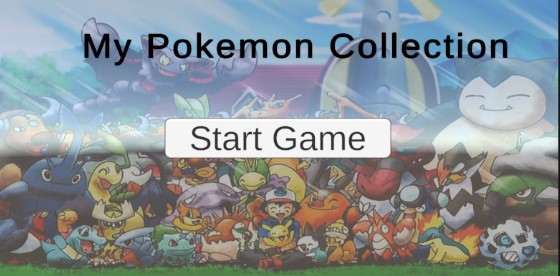
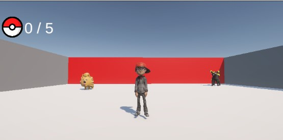
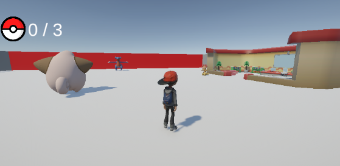

# My Pokemon Collection (3D Unity Game)

โปรเจกต์เกม 3D แนวเดินสำรวจและเก็บไอเทม (Collectathon) พัฒนาด้วยเอนจิน Unity 6 ผู้เล่นจะต้องควบคุมตัวละครออกสำรวจฉากต่างๆ และตามหาโปเกม่อนเป้าหมายให้ครบตามจำนวนที่กำหนดเพื่อผ่านด่าน

## 📸 Screenshots (ภาพตัวอย่างภายในเกม)

> **Main Menu:** หน้าจอเริ่มต้นเกม พร้อมระบบเปลี่ยนฉาก (Scene Management)

> **Level 1:** ด่านแรกของการผจญภัย ตามหาไอเทมให้ครบ 5 ชิ้น

> **Level 2:** ศูนย์วิจัยโปเกมอนสุดท้าทาย เก็บครบ 3 ชิ้นเพื่อชนะเกม

---

## ✨ Features (ระบบเด่นในเกม)

* **Physics-Based Movement:** ระบบควบคุมตัวละคร 3D โดยใช้ `Rigidbody` (เดิน, หันหน้าตามทิศทาง) เคารพกฎฟิสิกส์ ป้องกันการเดินทะลุกำแพง
* **Third-Person Camera:** มุมกล้องติดตามตัวละครแบบบุคคลที่ 3 ที่สามารถหมุนดูรอบตัวได้อย่างอิสระ
* **Item Collection System:** ระบบตรวจจับการชน (Trigger) เมื่อตัวละครสัมผัสไอเทม พร้อมระบบทำลายวัตถุ 
* **Dynamic UI & Score Manager:** หน้าจอแสดงผลคะแนนแบบเรียลไทม์ และระบบตรวจสอบเงื่อนไขการชนะ (Win Condition) ของแต่ละด่าน
* **Scene Management:** ระบบเชื่อมต่อด่านต่างๆ เข้าด้วยกันอย่างสมบูรณ์ (Menu -> Level 1 -> Level 2 -> Menu)

## 🛠️ Technologies Used (เครื่องมือที่ใช้พัฒนา)

* **Game Engine:** Unity 6 (6000.1.13f1)
* **Language:** C#
* **UI System:** Unity Canvas & TextMeshPro
* **3D Models:** โฟลเดอร์ `Models/Pokemon` (ไฟล์ .fbx)

## 🎮 How to Play (วิธีเล่น)

1. ใช้ปุ่ม `W, A, S, D` หรือ `ลูกศร` บนคีย์บอร์ดในการบังคับทิศทางตัวละคร
2. เลื่อน `เมาส์` เพื่อหมุนมุมกล้องสำรวจรอบฉาก
3. เดินชนเป้าหมายในฉากให้ครบตามตัวเลขมุมซ้ายบนของหน้าจอ
4. เมื่อเก็บครบ จะมีหน้าต่างแสดงความยินดีพร้อมปุ่มให้ใช้เมาส์คลิกเพื่อไปด่านต่อไป

## 📥 Installation (วิธีเปิดโปรเจกต์)

1. Clone repository นี้ลงในเครื่องของคุณ: `git clone https://github.com/ชื่อผู้ใช้ของคุณ/ชื่อโปรเจกต์.git`
2. เปิดโปรแกรม Unity Hub
3. กดปุ่ม `Add` และเลือกโฟลเดอร์โปรเจกต์ที่คุณเพิ่ง Clone มา
4. แนะนำให้เปิดด้วย Unity เวอร์ชัน `6000.1.13f1` หรือใหม่กว่า
5. ไปที่โฟลเดอร์ `Scenes` แล้วดับเบิลคลิกเปิดไฟล์ `MainMenu` เพื่อเริ่มทดสอบเกม
